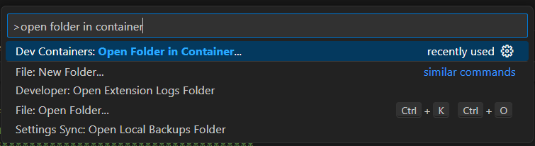

# <p style="text-align: center;"> Before Setting Up the Dev Environment </p>
Make sure that you have installed docker before doing this step. The following steps will not work if docker is not installed on your machine. The easiest way to check whether docker is installed correctly, open a terminal and

Also ensure that you 

# <p style="text-align: center;"> Installing the Development Container </p>
Clone the git repo
Install Dev container extension
Build and enter dev container for the repo


# <p style="text-align: center;"> Final Setup after Loading Development Container </p>
____________________________________________________________________________
Once you are inside your development container, go to the terminal and input the following commands.
```sh
cd src && bash setup.sh
```   
```sh
source ~/.bashrc
```   
Restart VSCode by closing it and reopening it to make sure all of the changes refresh properly  
____________________________________________________________________________


# <p style="text-align: center;"> Connecting Back to The Dev Container </p>
If you would like to close the container and resume development on it some other time then heres how you do that.  
First, open a VSCode window and click on the search bar at the very top. Instead of searching like you would normally, instead type ```>open folder in container```. Remember to include the ">" as thats what allows your VSCode search bar to run commands. Once you do that you should get a popup that looks something like this 
Click on Dev Containers: Open Folder in Container.  
This should navigate you to a file explorer. Using it, simply navigate to the folder that you cloned the github repo into and you should be back to your development container.

TODO: this would change if we want to make the base of the github repo the workspace instead of the src folder because you wouldn't use the folder that you cloned the github repo into 