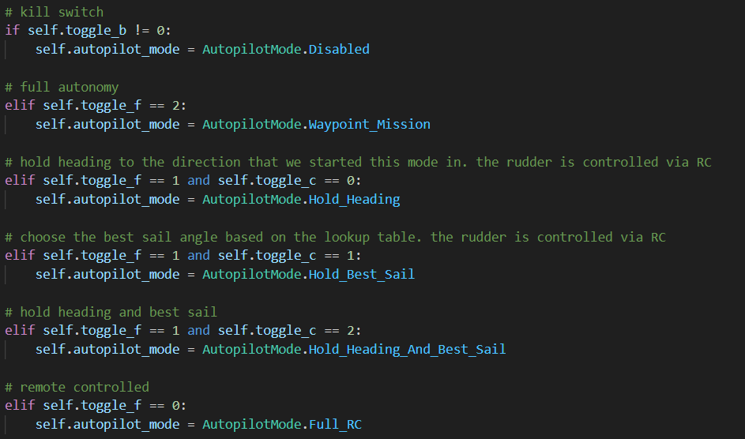

# <p style="text-align: center;"> Autopilot </p>

### Summary
This node is responsible for listening to data about the current state of the boat and a set of waypoints and publishing the desired rudder and sail angles based on our autopilot software. This node runs completely asynchronously on an internal timer, which means that a few times every seconds it runs a *non-blocking* script to calculate what the desired rudder and sail angles should be and publishes them when its done.

Additionally, this node publishes data that is useful for telemetry and debugging such as the the current maneuver it is attempting to perform and what its desired heading is currently.

In order for us to be able to control and tune parameters for the autopilot from the groundstation, this node also listens for autopilot_parameters. These are jsons (serialized as strings) which detail all of the new parameters and what their values should be. These values are sent from the groundstation to the telemetry server, then to the telemetry node and then finally to the autopilot.

An important thing to note is that this node also controls basic RC override, which is why it needs to listen into the raw RC data. There are several different types of RC override listed below:  
`- Fully Disabled`  
`- Full RC Control`  
`- Autopilot Holds "Best" Sail Angle; RC Controlled Rudder`  
`- Autopilot Holds the Current Heading with the Rudder; RC Controlled Sail`  
`- Autopilot Holds "Best" Sail Angle; Autopilot Holds the Current Heading with the Rudder`  
`- Autopilot Waypoint Mission`  

These different modes can be switched into with different combinations of switches on the controller. Heres a snapshot of the code used to determine the current mode: 


TODO: There are various modes related to RC override that the autopilot can "switch into". Depending 

<br>
### The Autopilot Parameters System


### Command to Run the Node
``` sh
ros2 run autopilot autopilot
```

<br>
### Listens to the Following Topics
- /position (NavSatFix from sensor_msgs)
- /velocity (Twist from geometry_msgs)
- /heading (Float32 from std_msgs)
- /apparent_wind_vector (Vector3 from geometry_msgs)
- /autopilot_parameters (String from std_msgs)
- /rc_data (RCData from sailbot_msgs)
- /autopilot_mode (String from std_msgs)
- /waypoints_list (WaypointList from sailbot_msgs)

### Publishes to the Following Topics